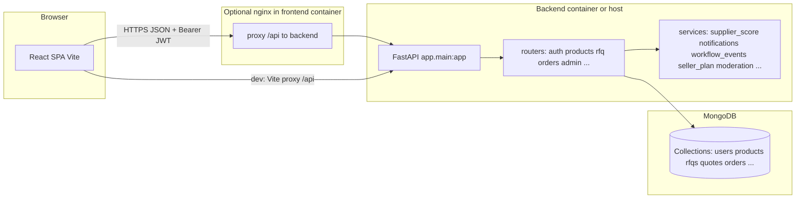
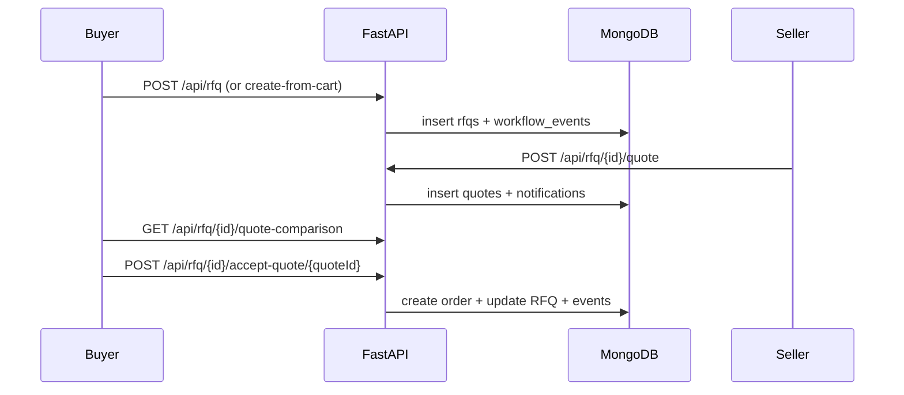

# AI briefing: SmartB2B / B2Bभारत — full project context for presentations

**Purpose:** Attach this entire file when asking Claude (or any LLM) to produce slides, a pitch deck, a technical walkthrough, or documentation. It is written to be **self-contained**: product story, architecture, data model, API surface, UI, ops, and demo credentials in one place.

**Repository folder name:** `SmartB2B`  
**Product / API branding:** **B2Bभारत** — intelligent B2B marketplace  
**Tagline (from project docs):** *Smarter B2B. Real Deals.*

---

## 1. How to use this with Claude

Suggested prompt pattern:

> Using only the attached `AI_PROJECT_BRIEF_FOR_CLAUDE.md`, create a [N]-slide presentation for [audience: investors | technical | mixed]. Include: problem, solution, personas, core flows (RFQ → quote → order), trust scoring, monetization (subscriptions + payments simulation), tech stack, high-level architecture diagram (Mermaid), roadmap / non-goals, and a demo script using the test accounts in section 15.

Constraints you may add:

- Emphasize **India / B2B** positioning if desired (Hindi branding in name is intentional).
- Distinguish **MVP vs later phases** using section 4 milestones.
- For **strict technical accuracy**, cross-check OpenAPI at `GET /docs` on a running backend (versions may drift slightly).

---

## 2. Elevator pitch

B2Bभारत is a **full-stack B2B marketplace** where:

- **Buyers** discover products, use **wishlist** and **RFQ cart**, raise **RFQs (request for quotation)**, compare **seller quotes** with **trust scores** and **quote scores**, accept a quote, and track **orders** through fulfillment. They get **in-app notifications**, **RFQ/order timelines**, role-specific **dashboard** metrics, and optional **order payment / escrow-style** flows (simulated in demo).
- **Sellers** maintain a **company profile** and **product catalog**, respond to assigned RFQs with **quotes** (including revisions/counter-offers where implemented), fulfill **orders** with a defined status pipeline, and can subscribe to **tiered seller plans** (Free / Go / Pro — catalog served by API).
- **Admins** verify suppliers, moderate users and messages, manage categories, monitor RFQs and orders, view **analytics** (overview, top suppliers, category performance, top products, RFQ/order trends), review **subscriptions** and **payments**, and enforce bans.

**Explicitly out of scope (per README):** production ML / recommendation models — deferred.

---

## 3. Personas & permissions

| Role   | Capabilities (summary) |
|--------|-------------------------|
| **buyer** | Wishlist, RFQ cart, RFQs, quote comparison, orders, notifications, buyer dashboard, public catalog & supplier discovery |
| **seller** | Company profile, products CRUD, assigned RFQs, quotes & revisions, orders, seller dashboard, notifications, **seller subscription** checkout & simulation |
| **admin** | Full admin panel: users, suppliers verify/unverify, categories, RFQs/orders visibility, logs, analytics, moderation (flagged messages), billing overview (subscriptions/payments/revenue summary) |

**Auth:** JWT in `Authorization: Bearer <token>`. Passwords hashed with **bcrypt** via **passlib**. Banned users receive **403** with a clear message.

**Frontend route protection:** `ProtectedRoute` wraps routes; optional `allowedRoles` restricts buyers/sellers/admins; wrong role redirects to `/dashboard`.

---

## 4. Milestones (what shipped when — narrative for slides)

1. **Phase 1 (MVP):** Register/login (buyer/seller), JWT + `/api/auth/me`, company profile, products CRUD + public listing, inquiries, minimal admin summary, core React pages + protected routes.
2. **Phase 1.6:** API discovery (`/`, `/health`, `/api`, `/docs`), CORS, rate limiting (SlowAPI when installed), centralized validation errors, UI polish (design system direction, motion).
3. **Marketplace + trust + RFQ → order:** Wishlist, RFQ cart, RFQ lifecycle, quotes, accept → order, order statuses, supplier trust scores & levels, admin verification, richer admin + analytics.
4. **Workflow & engagement:** `workflow_events` timelines on RFQs/orders, `notifications` collection + API + UI bell + page, quote comparison API, public supplier profile, buyer/seller dashboards.
5. **Extensions visible in codebase:** **Counter-offers** on RFQs, **seller subscription plans** + payment simulation, **order-level payments** (initiate / simulate / release) unified with a `payments` collection, **message moderation** admin endpoints, **Recharts** on frontend for analytics-style charts, public **market stats** endpoint.

Use this progression for a “journey” or “roadmap” slide without inventing dates — the repo does not assert release dates.

---

## 5. Core business flows (for sequence diagrams)

### 5.1 Buyer: discovery → RFQ → order

1. Register/login as buyer.
2. Browse **Products** (`/products`, `/product/:id`) — public catalog with search/filter parameters supported by API.
3. Save items to **Wishlist**; build **RFQ cart**; create RFQ (manual payload or **create-from-cart**).
4. Sellers assigned to RFQ submit **quotes**; buyer views **quote comparison** (ranked by composite **quote score**).
5. Buyer **accepts** one quote → **order** created (and downstream notifications/workflow events as implemented).
6. Track **orders** (`/orders`, `/orders/:id`) including **timeline**; optional **order payments** UI/API for escrow-style demo.

### 5.2 Seller: profile → quote → fulfillment

1. Complete **company profile** (`/profile/company`).
2. Manage **products** (`/seller/products`).
3. View **assigned RFQs** (`/seller/rfqs`), submit/update quotes (`/api/rfq/{id}/quote`, `/api/quote/{id}`).
4. On acceptance, progress **order status**: pipeline documented as **created → confirmed → processing → shipped → delivered** (align slides with this wording).
5. **Subscription** optional: `/seller/subscription` and checkout route for sellers.

### 5.3 Admin: trust & operations

- Dashboard/summary, user ban/unban, supplier verify/unverify, **recalculate** supplier score, categories CRUD, RFQ/order oversight, **admin action logs**, **analytics** endpoints, moderation queues, revenue/subscription/payment views.

---

## 6. System architecture (logical)

**Pattern:** Single-page **React** app talks **REST JSON** to **FastAPI**; backend uses **async Motor** driver to **MongoDB**. JWT is stateless; session data lives in Mongo.

**Deployment shapes:**

- **Local dev:** Vite on **5173** with `server.proxy` forwarding `/api` → `http://localhost:5000`; backend **uvicorn** uses `settings.port` (default **5000**).
- **Docker Compose:** `mongo:7` on **27017**, `backend` **5000**, `frontend` image serves **nginx** on **5173:80** with `/api` **reverse-proxied** to `http://backend:5000`.
- **Production build note:** Backend can optionally mount `frontend/dist/assets` when that folder exists (static segment); primary SPA hosting in compose is the **frontend** container with SPA `try_files` fallback.



---

## 7. Technology stack (exact versions from manifests)

### 7.1 Backend (`backend/requirements.txt`)

| Package | Version | Role |
|---------|---------|------|
| fastapi | 0.109.2 | HTTP API framework |
| uvicorn[standard] | 0.27.1 | ASGI server |
| motor | 3.3.2 | Async MongoDB |
| pymongo | 4.6.1 | BSON / errors |
| pydantic | 2.6.1 | Models & validation |
| pydantic-settings | 2.1.0 | Settings from env |
| email-validator | 2.1.1 | Email fields |
| python-jose[cryptography] | 3.3.0 | JWT |
| bcrypt | 4.2.1 | Password hashing (pinned; README notes 5.x breaks passlib 1.7.4) |
| passlib[bcrypt] | 1.7.4 | Password helpers |
| python-multipart | 0.0.9 | Forms/uploads |
| python-dotenv | 1.0.1 | Env loading |
| slowapi | 0.1.9 | Rate limiting (optional import guard) |
| faker | 24.4.0 | Demo data generation |

**Runtime:** Docker image `python:3.12-slim`; local README historically mentions **Python 3.11+** — both are acceptable; lock presentations to **3.12** if citing Dockerfile only.

**Entry:** `python run.py` → uvicorn `app.main:app`, host `0.0.0.0`, reload when `NODE_ENV`/`node_env` is `development`.

### 7.2 Frontend (`frontend/package.json`)

| Area | Choice |
|------|--------|
| UI library | React **18.2** |
| Build | **Vite 5** |
| Routing | **React Router 6** |
| HTTP | **Axios** |
| Styling | **TailwindCSS 3.4** |
| Motion | **Framer Motion 11** |
| Icons | **Lucide React** |
| Charts | **Recharts 2.12** |
| Lint/format | ESLint, Prettier |

**Node in Docker:** `node:20-alpine` builder → `nginx:alpine` runtime.

### 7.3 Data & ops

- **Database:** MongoDB **7** (compose).
- **Orchestration:** Docker Compose **3 services** (`mongo`, `backend`, `frontend`), volume `mongo_data`.
- **API documentation:** OpenAPI / Swagger UI at **`/docs`**, title **“B2Bभारत API”**, version **1.0.0**.

---

## 8. Backend layout (mental map)

```
backend/
  run.py                 # uvicorn entry
  requirements.txt
  Dockerfile             # python:3.12-slim, uvicorn app.main:app :5000
  app/
    main.py              # FastAPI app, CORS, validation handler, router mounts, optional static
    config.py            # pydantic-settings: port, node_env, mongodb_uri, db_name, jwt_*, cors_origin
    database.py          # Motor client singleton, db name from URI path or DB_NAME, ping on startup
    dependencies.py      # JWT decode, get_current_user, require_roles, bcrypt hash/verify
    routers/             # one module per domain (see section 9)
    schemas/             # Pydantic request/response models per domain + common error shape
    services/            # cross-cutting domain logic
  scripts/
    seed.py              # minimal deterministic seed
    generate_demo_data.py # large synthetic dataset; preserves fixed test accounts
    demo_plans_payments.py # demo helpers (billing)
    ...                  # many internal _patch_* maintenance scripts — ignore for presentations unless discussing dev process
```

**`app.services` modules (for “architecture” slides):**

- `supplier_score.py` — trust & quote ranking math (documented in docstrings).
- `notifications.py` — user notification creation/delivery patterns.
- `workflow_events.py` — append-only style events for timelines (`workflow_events` collection).
- `seller_plan.py` — reads seller plan flags / expiry from `users` (e.g. `subscriptionPlan`, `sellerPlanExpiresAt`, `isFeaturedSupplier`, `isProSearchBoost`).
- `admin_audit.py` — admin action logging patterns.
- `contact_moderation.py` / `message_thread.py` — RFQ messaging and moderation hooks.
- `expiry_helpers.py` — time/expiry utilities for plans or entities.

---

## 9. HTTP API catalog (routers & notable paths)

**Global / discovery (`root` router):**

- `GET /` — HTML landing with links.
- `GET /health` — JSON health (includes uptime, db, version-style metadata — good for ops slides).
- `GET /api` — JSON route index.
- `GET /api/public/stats` — public market statistics for marketing home.

**Auth — prefix `/api/auth`:**

- `POST /register`, `POST /login`, `GET /me`.

**Company — `/api/company`:**

- `POST /` (upsert), `GET /me`.

**Products — `/api/products`:**

- `GET /` (public list + query params), `GET /seller/me`, `GET /{id}`, `POST /`, `PUT /{id}`, `DELETE /{id}`.

**Inquiries — `/api/inquiries`:**

- `POST /`, `GET /me`.

**Categories — `/api/categories`:**

- `GET /` (public list), `POST /`, `PUT /{id}`, `DELETE /{id}` (admin-gated in implementation — verify in router if presenting security model).

**Wishlist — `/api/wishlist`:**

- `GET /`, `POST /{productId}`, `DELETE /{productId}`.

**Cart — `/api/cart`:**

- `GET /`, `POST /`, `PUT /{productId}`, `POST /clear`, `DELETE /{productId}`.

**RFQ — mounted at both `/api/rfq` and `/api/rfqs` (duplicate prefix, same router):**

- `POST /create-from-cart`, `POST /` (create), `GET /me`, `GET /assigned` (seller), `GET /{id}`, `PUT /{id}/status`.
- Quotes: `POST /{id}/quote`, `GET /{id}/quotes`, `GET /{id}/quote-comparison`, `POST /{id}/accept-quote/{quoteId}`, `POST /{id}/reject-quote/{quoteId}`.
- Negotiation: `GET /{id}/counter-offers`, `POST /{id}/counter-offer`.
- Collaboration: `GET /{id}/messages`, `POST /{id}/messages`.
- `GET /{id}/timeline`.

**Quote revision — `/api/quote`:**

- `PUT /{id}`.

**Orders — `/api/orders` (core router + payments router on same prefix):**

- `GET /me`, `GET /{id}`, `GET /{id}/timeline`, `PUT /{id}/status`, `PUT /{id}/payment`.
- **Payments router:** `GET /{order_id}/payments`, `POST /{order_id}/payments/initiate`, `POST /{order_id}/payments/{payment_id}/simulate`, `POST /{order_id}/payments/release`.

**Messages (alternate/thread style) — `/api/messages`:**

- `GET /{rfqId}`, `POST /{rfqId}`.

**Admin — `/api/admin`:**

- `GET /summary`, `GET /dashboard`.
- Users: `GET /users`, `GET /user-profile/{user_id}`, `PUT /users/{id}/ban`, `PUT /users/{id}/unban`, `PUT /users/{id}/verify-supplier`.
- Suppliers: `GET /suppliers`, `POST /suppliers/{seller_id}/verify`, `PUT /suppliers/{seller_id}/unverify`, `POST /suppliers/{seller_id}/recalculate-score`.
- Catalog & ops: `GET /rfqs`, `GET /orders`, `GET /categories`, `GET /logs`.
- Analytics: `GET /analytics/overview`, `.../top-suppliers`, `.../category-performance`, `.../top-products`, `.../rfq-trends`, `.../order-trends`.
- Moderation: `GET /moderation/messages`, `GET /flagged-messages`.
- Billing: `GET /subscriptions`, `GET /payments`, `GET /revenue-summary`.

**Suppliers (public-ish) — `/api/suppliers`:**

- `GET /` (directory/list with params), `GET /{seller_id}/score`, `GET /{seller_id}/profile`.

**Notifications — `/api/notifications`:**

- `GET /me`, `PUT /{id}/read`, `PUT /read-all`.

**Dashboards:**

- `GET /api/seller/dashboard`, `GET /api/buyer/dashboard`.

**Subscriptions — `/api/subscriptions`:**

- `GET /plans` (catalog: **free**, **go**, **pro** tiers from in-code `PLAN_CATALOG`).
- `GET /me` (seller), `POST /checkout`, `POST /payment/{payment_id}/simulate` (demo payment completion).

---

## 10. MongoDB collections (extended)

| Collection | Purpose |
|------------|---------|
| `users` | Auth, `role`, ban flags, seller plan fields, verified supplier flags |
| `companyprofiles` | Seller company metadata |
| `categories` | Product taxonomy |
| `products` | Listings (seller, pricing, MOQ, geo, active flag, plan/search boost fields as implemented) |
| `wishlistitems`, `cartitems` | Buyer wishlist & RFQ cart lines |
| `rfqs`, `quotes` | RFQ documents & seller quotes (including counter-offer linkage if present) |
| `orders` | Post-acceptance fulfillment + payment status fields |
| `supplier_scores` | Trust components + total + trust level |
| `adminactionlogs` | Admin audit trail |
| `workflow_events` | Append-only timeline entries |
| `notifications` | Per-user notification documents |
| `seller_subscriptions` | Seller subscription purchases lifecycle |
| `payments` | **Unified** payments store for subscription checkouts and **order_escrow** style rows (`paymentType`, `relatedEntityId`, statuses like simulated / released) |

**Serialization note:** API layer often uses helpers so JSON includes **`id`** alongside legacy **`_id`** where needed — presenters can say “Mongo-native storage, JSON-friendly responses.”

---

## 11. Trust & quote scoring (copy-ready for a “science” slide)

From `supplier_score` service (weights sum to **1.0**):

**Trust score components (each nominally 0–100 before weighting):**

- **0.30** × profile completeness  
- **0.20** × response rate  
- **0.20** × product strength  
- **0.15** × buyer rating  
- **0.15** × verified status (**100** if admin-verified supplier, else **0**)

**Trust levels (on weighted total 0–100):**

- **85–100:** Highly Trusted  
- **70–84:** Trusted  
- **50–69:** Moderate  
- **&lt;50:** Low Trust  

**Cold-start defaults (when data is thin):**

- response_rate default **50**  
- product_strength default **50** if no active products; else capped formula based on active count  
- buyer_rating default **70** until real reviews exist  

**Quote score (buyer comparison ranking):**

- **50%** price competitiveness + **25%** delivery speed + **25%** supplier trust score  

Say clearly on slides: **ranking is transparent and tunable**, not a black-box ML model.

---

## 12. Frontend structure (for “UI architecture” slides)

**Entry:** `frontend/src/main.jsx`, routes in `App.jsx`, layout via **`AppShell`** + **`Navbar`**.

**State:** `context/AuthContext.jsx` — holds user + token sync with `localStorage` keys **`token`** and **`smartb2b_user`** (must match `api/client.js`).

**API layer:** `src/api/client.js` — Axios instance, JWT interceptor, 401 → clear storage & redirect `/login`, grouped API objects (`authApi`, `rfqApi`, `adminApi`, `ordersApi`, `subscriptionApi`, …).

**Notable pages (file → responsibility):**

| Route pattern | Page component | Notes |
|---------------|----------------|-------|
| `/` | `Home.jsx` | Marketing + public stats |
| `/login`, `/register` | `Login.jsx`, `Register.jsx` | Auth |
| `/products`, `/product/:id` | `Products.jsx`, `ProductDetail.jsx` | Catalog |
| `/suppliers`, `/suppliers/:id` | `Suppliers.jsx`, `SupplierProfile.jsx` | Directory + public profile |
| `/wishlist`, `/cart` | `Wishlist.jsx`, `Cart.jsx` | Buyer only |
| `/rfq`, `/rfqs`, `/rfq/:id`, `/rfqs/:id` | `RFQList.jsx`, `RFQDetail.jsx` | Buyer list; detail any permitted role |
| `/orders`, `/orders/:id` | `Orders.jsx`, `OrderDetail.jsx` | Buyer/seller/admin + payment panel component |
| `/seller/products`, `/seller/rfqs` | `SellerProducts.jsx`, `SellerRFQs.jsx` | Seller |
| `/seller/subscription`, `/seller/subscription/checkout/:paymentId` | `Subscription.jsx`, `SubscriptionCheckout.jsx` | Seller plans |
| `/profile/company` | `CompanyProfile.jsx` | Seller |
| `/dashboard` | `Dashboard.jsx` | Role-specific dashboard |
| `/admin/panel` | `AdminPanel.jsx` | Admin |
| `/notifications` | `Notifications.jsx` | Authenticated |

**404 behavior:** `path="*"` → redirect `/`.

**Design tokens:** `src/theme.js` + Tailwind extensions — primary palette documented as **indigo-scale** in `theme.js` (README also mentions **teal + coral + Plus Jakarta Sans** for marketing pages — presenters can say “brand gradients on marketing, tokenized design system in code” without overstating consistency).

**Time localization:** `src/lib/istTime.js` — India Standard Time helpers for display.

**Reusable UI:** `components/ui/*` (Button, Card, Input, Table, Badge, …), `StatCard`, `SkeletonCard`, `OrderPaymentPanel`, `SupplierPlanBadges`.

---

## 13. Configuration & environment

### Backend (`app.config.Settings`)

| Field | Env aliases | Typical value |
|-------|-------------|----------------|
| `port` | (constructor default) | `5000` |
| `node_env` | `NODE_ENV` | `development` / `production` |
| `mongodb_uri` | `MONGODB_URI`, `MONGO_URL`, `DATABASE_URL` | `mongodb://localhost:27017/smartb2b` |
| `db_name` | `DB_NAME`, `MONGO_DB_NAME` | optional override if URI has no db segment |
| `jwt_secret` | `JWT_SECRET` | strong secret in prod |
| `jwt_expires_in` | `JWT_EXPIRES_IN` | e.g. `7d` (also supports `h` in custom `create_access_token`) |
| `cors_origin` | `CORS_ORIGIN`, `CORS_ORIGINS`, `ALLOWED_ORIGINS` | Comma-separated list |

### Frontend

- `VITE_API_URL` — if **empty**, dev uses **same-origin `/api`** via Vite proxy; production nginx forwards `/api` to backend service.

### Docker Compose (reference)

- Backend `MONGODB_URI=mongodb://mongo:27017/smartb2b`
- `JWT_SECRET` from host env or default placeholder — warn audiences **not** to ship default secrets.

---

## 14. Security & reliability talking points

- **JWT** stateless auth; **role-based access** on sensitive routers.
- **CORS** configurable; credentials enabled for cookie-ready setups (Bearer still primary).
- **SlowAPI** rate limiter integrated when package present; exceeds → dedicated handler.
- **Validation errors** normalized to JSON with `VALIDATION_ERROR` code + field details.
- **Ban** enforced at auth dependency layer (403).
- **Contact moderation** hooks for RFQ messages — admin visibility endpoints exist (`moderation/messages`, `flagged-messages`).
- **Docker networking:** README/database layer warns: in containers, `localhost` is **not** other services — use service DNS name **`mongo`**.

---

## 15. Demo accounts & scripts (for live demo slides)

**After `python -m scripts.seed` (minimal) or full demo generator:**

| Role | Email | Password |
|------|-------|----------|
| Admin | `admin@smartb2b.com` | `Admin@123` |
| Seller | `seller@example.com` | `Seller@123` |
| Buyer | `buyer@example.com` | `Buyer@123` |

**Demo dataset:** `python -m scripts.generate_demo_data` — large synthetic dataset; **clears prior demo-generated data** but **keeps** the three accounts above; other demo users often use **`Demo@123`**.

**Docker seed:** `docker compose exec backend python -m scripts.seed` after DB healthy.

---

## 16. Suggested Mermaid diagrams for slides

**RFQ lifecycle (simplified):**



**Monetization (conceptual):**

```mermaid
flowchart TB
  subgraph subs [Seller subscriptions]
    P[GET /api/subscriptions/plans]
    C[POST /api/subscriptions/checkout]
    M[seller_subscriptions + payments collections]
  end
  subgraph ord [Order funds demo]
    I[POST .../payments/initiate]
    SIM[POST .../payments/{id}/simulate]
    REL[POST .../payments/release]
  end
  P --> C --> M
  I --> SIM --> REL
```

---

## 17. “What not to claim” guardrails

- Do **not** claim live **payment gateway** production integration unless the repo adds real PSP keys — current flows include **simulate** endpoints for demos.
- Do **not** claim **ML recommendations** — explicitly deferred in README.
- **Trust scores** are **heuristic**, not a regulatory certification.

---

## 18. Slide outline starter (editable)

1. Title — B2Bभारत / Smart B2B marketplace for India-oriented sourcing narrative  
2. Problem — fragmented B2B quoting, trust asymmetry, opaque supplier quality  
3. Solution — RFQ-led marketplace with transparent scoring & workflows  
4. Personas — buyer / seller / admin  
5. Core loop (screenshots placeholders) — browse → cart → RFQ → quotes → accept → order  
6. Trust model — formula slide (section 11)  
7. Operations — notifications + timelines + dashboards  
8. Monetization — plans + payments simulation + admin revenue views  
9. Tech stack — section 7 tables  
10. Architecture — section 6 diagram  
11. Security & compliance posture — section 14 (high level)  
12. Roadmap — ML deferred; enterprise integrations TBD  
13. Live demo script — section 15 credentials + RFQ happy path  
14. Q&A

---

## 19. File paths quick index (for engineers reviewing slides)

- Backend app factory: `backend/app/main.py`
- Settings: `backend/app/config.py`
- DB: `backend/app/database.py`
- Auth helpers: `backend/app/dependencies.py`
- Routers: `backend/app/routers/*.py`
- Frontend routes: `frontend/src/App.jsx`
- HTTP client: `frontend/src/api/client.js`
- Compose: `docker-compose.yml`
- Docker: `backend/Dockerfile`, `frontend/Dockerfile`, `frontend/nginx.conf`
- Human README (duplicate name in repo): `README - Copy.md` (rich narrative aligned with this brief)

---

*End of briefing — safe to truncate from the bottom upward if a shorter context window is needed; sections 2–12 + 15 carry the highest signal for most decks.*
